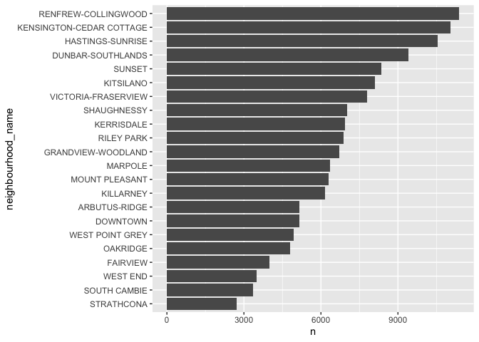
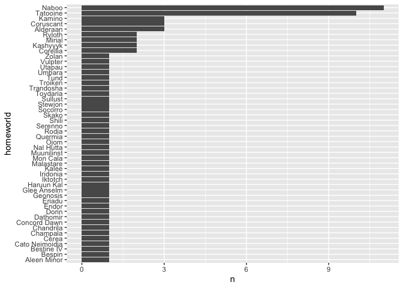

Assignment_B1
================
Mathias Delhaye
02/11/2021

# Loading the needed packages

``` r
library(tidyverse)
```

    ## ── Attaching packages ─────────────────────────────────────── tidyverse 1.3.1 ──

    ## ✓ ggplot2 3.3.5     ✓ purrr   0.3.4
    ## ✓ tibble  3.1.5     ✓ dplyr   1.0.7
    ## ✓ tidyr   1.1.4     ✓ stringr 1.4.0
    ## ✓ readr   2.0.2     ✓ forcats 0.5.1

    ## ── Conflicts ────────────────────────────────────────── tidyverse_conflicts() ──
    ## x dplyr::filter() masks stats::filter()
    ## x dplyr::lag()    masks stats::lag()

``` r
library(testthat)
```

    ## 
    ## Attaching package: 'testthat'

    ## The following object is masked from 'package:dplyr':
    ## 
    ##     matches

    ## The following object is masked from 'package:purrr':
    ## 
    ##     is_null

    ## The following objects are masked from 'package:readr':
    ## 
    ##     edition_get, local_edition

    ## The following object is masked from 'package:tidyr':
    ## 
    ##     matches

``` r
library(gapminder)
library(ggplot2)
library(datateachr)
library(palmerpenguins)
```

# Building the function

``` r
#' @title Counting iteration
#' 
#' @description This function count the number of iteration for the different possibilities of one variable of a table
#' 
#' @params data is a table
#' @params x is the name of the variable for which we want to count the number of iteration for the different possibilities
#' 
#' @return a plot of columns in the decreasing order, showing the counts for every possibilities of the variable of interest
#' 
#' @examples
#' counting_iteration(vancouver_trees, neighbourhood_name), to count the iteration of each neighbourhood in the dataset vancouver_trees
#' counting_iteration(penguins, species) to count the iteration of each specie in the dataset penguins
#' counting_iteration(starwars, homeworld) to count the iteration of each homeworld in the dataset starwars

counting_iteration <- function (data, x) {
  data%>%
    group_by({{x}})%>%
    summarise(n=n())%>%
    drop_na()%>%
    mutate({{x}} := fct_reorder({{x}}, n))%>%
    ggplot(aes({{x}}, n))+
    geom_col()+
    coord_flip()
}
```

# Examples

``` r
counting_iteration(vancouver_trees, neighbourhood_name)
```

<!-- -->

Here we used the data set *vancouver_trees* and look for the number of
trees planted in each neighborhood for the studied period.

``` r
counting_iteration(penguins, species)
```

<!-- -->

Here we used the data set *penguins* from the library
**palmerpenguins**, and look at the number of penguins for each specie.

``` r
counting_iteration(starwars, homeworld)
```

<!-- -->

Here we used the data set *starwars* to look at the number of character
coming from each world.

# Testing the function

``` r
test_that("counting_iteration function", {
  expect_equal(
        as.character(rlang::get_expr(counting_iteration(vancouver_trees, neighbourhood_name)$mapping$y)), "n") #checking the name of the y axis
  expect_equal(
    as.character(rlang::get_expr(counting_iteration(vancouver_trees, neighbourhood_name)$mapping$x)), "neighbourhood_name"
  ) #checking the name of the y axis
  expect_error(counting_iteration(gapminder, year)) #the function does not work with a variable containing numerical value
  expect_true(
        "GeomCol" %in% class(counting_iteration(vancouver_trees, neighbourhood_name)$layers[[1]]$geom)) #the class of the plot should be GeomCol
})
```

    ## Test passed 🎊
