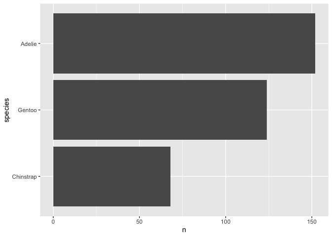

<!-- README.md is generated from README.Rmd. Please edit that file -->

# countiteration

<!-- badges: start -->
<!-- badges: end -->

The goal of countiteration is to count the number of iteration of each
possibility of a variable from a tibble. This does not include the NA
that can be found in the variable. This function doesn’t work on
numerical variable.

## Installation

You can install the development version of countiteration from
[GitHub](https://github.com/) with:

``` r
# install.packages("devtools")
devtools::install_github("stat545ubc-2021/functions-mathiasdelhaye")
```

## Example

This is a basic example which shows you how to solve a common problem:

``` r
library(countiteration)
counting_iteration(palmerpenguins::penguins, species)
```


